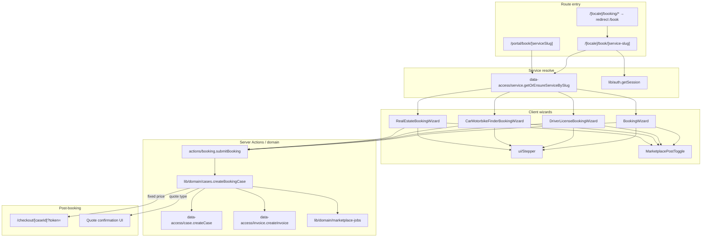
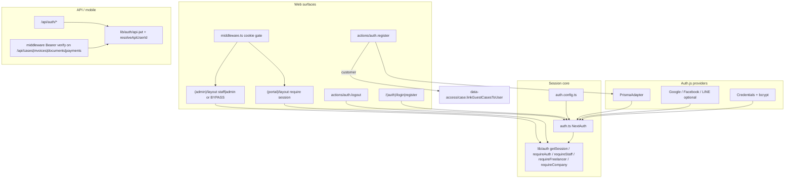
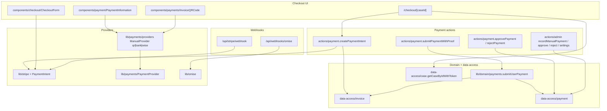
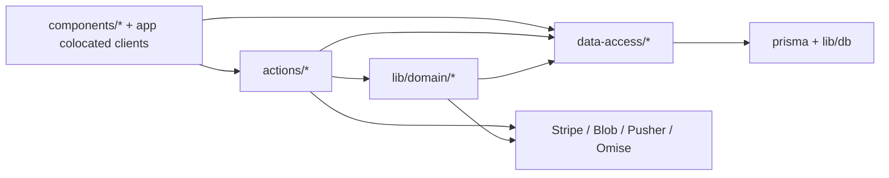

# SiamEZ 2.0 — Dependency Graphs

**Status:** Current as of 2026-08-01 · **Code modified:** None  
**Source of truth:** live `src/` reads (companion to [AUDIT.md](./AUDIT.md))

These graphs show **runtime call / ownership edges**, not every import. Prefer extending the KEEP nodes; avoid new parallel paths.

---

## 1. Booking pipeline

Public and portal book pages share the same wizard stack and `submitBooking` → `createBookingCase` core.

**Notes (verified):**

- Book page switches on slug: `driver-license`, `car-motorbike-finder-selling-service`, `real-estate-services` → specialty wizards; else `BookingWizard`.
- All four wizards call `submitBooking` and currently pass `documentIds: undefined`.
- `Service.formConfig` exists in Prisma but is **not read** at runtime (P2 target).
- Validation today: `lib/booking-schema.ts` (`clientDetailsSchema`) + ad-hoc wizard state; no RHF.

---

## 2. Auth & session

Two auth planes: cookie JWT (web) and Bearer JWT (mobile/API). Middleware gates portal/admin cookies; layouts enforce roles.

**Notes (verified):**

- JWT strategy, 7-day maxAge; role on token (session callback hits DB — IMPROVE target).
- Portal: middleware cookie + layout `getSession` redirect.
- Admin: layout role check; `BYPASS_ADMIN_AUTH=true` skips for local/cloud VMs.
- `src/lib/session.ts` (iron-session) is **unused** — safe to ignore for 2.0.
- Critical gap: `actions/case.ts` has **no** `requireAuth` / `requireStaff` (see backlog).

---

## 3. Payments & checkout

Stripe Intent path + manual proof (QR/bank/Wise) + webhooks. Provider interface already abstracts manual methods.

**Notes (verified):**

- Guest checkout: `guestCheckoutToken` on Case; `createPaymentIntent` accepts `guestToken`.
- Logged-in proof path: `requireAuth` → `submitUserPayment`.
- Admin payment settings: `getAdminPaymentSettings` / `updateAdminPaymentSettings` (guarded).
- Folder split: `components/payment/` vs `components/payments/` — consolidate later, do not fork logic.

---

## 4. Portal (customer / freelancer / company)

```mermaid
flowchart TB
  subgraph Gate["Access"]
    MW["middleware portal cookie"]
    Layout["(portal)/layout → PortalLayoutClient"]
    Role["portal/page role redirect"]
  end

  subgraph Shell["Shell components"]
    Sidebar["layout/PortalSidebar"]
    TopBar["portal/PortalTopBar"]
    UserMenu["portal/UserMenu"]
    Lang["portal/LanguageSwitcher"]
    Footer["portal/PortalFooter"]
  end

  subgraph Customer["Customer routes"]
    Dash["portal/ SummaryCard + ActivityFeed"]
    Cases["portal/cases"]
    Invs["portal/invoices"]
    Docs["portal/documents"]
    Profile["portal/profile"]
    ClientJobs["portal/client/jobs/[id]"]
    Book["portal/book/[serviceSlug]"]
  end

  subgraph Freelancer["Freelancer"]
    FDash["portal/freelancer"]
    FFeed["FreelancerJobFeed"]
    FProf["portal/freelancer-profile"]
    FJobs["portal/jobs/[id] ChatBox + tracking"]
  end

  subgraph Company["Company"]
    CDash["portal/company CompanyDashboardClient"]
    Sales["portal/sales"]
    RE["portal/real-estate"]
  end

  subgraph Data["Data + actions"]
    CaseDA["data-access/case|invoice|document|activity|job"]
    ClientAct["actions/client-jobs"]
    FreeAct["actions/freelancer-jobs|profile"]
    CompAct["actions/company"]
    PortalSet["actions/portal-settings"]
  end

  MW --> Layout
  Layout --> Sidebar
  Layout --> TopBar
  Layout --> Role
  Role --> Dash
  Role --> FDash
  Role --> CDash
  Dash --> CaseDA
  Cases --> CaseDA
  Invs --> CaseDA
  Docs --> CaseDA
  ClientJobs --> ClientAct
  FDash --> FreeAct
  FFeed --> FreeAct
  FJobs --> FreeAct
  CDash --> CompAct
  Book --> GetSvc["getOrEnsureServiceBySlug + wizards"]
```

**Notes (verified):**

- Customer dashboard aggregates cases, invoices, documents, service jobs via data-access.
- Job tracking/chat: `components/client/*`, `components/jobs/ChatBox`, Pusher hooks (`use-job-channel`).
- No notification inbox UI yet (prefs exist in `lib/notification-preferences`).

---

## 5. Admin ops

```mermaid
flowchart TB
  subgraph Gate["Access"]
    MW["middleware admin cookie"]
    Layout["(admin)/layout staff|admin or BYPASS"]
    Sidebar["layout/AdminSidebar"]
  end

  subgraph Surfaces["Primary surfaces"]
    Dash["admin/dashboard"]
    Cases["admin/cases"]
    Clients["admin/clients"]
    Services["admin/services"]
    Invoices["admin/invoices"]
    Payments["admin/payments"]
    Docs["admin/documents"]
    Calendar["admin/calendar"]
    Freelancers["admin/freelancers + freelancer-jobs"]
    Companies["admin/companies + company-jobs + ads"]
    SalesRE["admin/sales + real-estate"]
    Staff["admin/staff"]
    Settings["admin/settings"]
    Reports["admin/reports placeholder"]
  end

  subgraph Actions["Server Actions"]
    AdminTS["actions/admin.ts ~1.5k LOC"]
    InvAct["actions/invoice requireStaff"]
    DocAct["actions/document adminUpload*"]
    PayAct["actions/payment approve/reject"]
    SalesAct["actions/sales|real-estate|sales-boost"]
    CaseAct["actions/case UNGUARDED"]
  end

  MW --> Layout
  Layout --> Sidebar
  Dash --> AdminTS
  Cases --> AdminTS
  Clients --> AdminTS
  Services --> AdminTS
  Invoices --> InvAct
  Invoices --> AdminTS
  Payments --> AdminTS
  Payments --> PayAct
  Docs --> DocAct
  Docs --> AdminTS
  Calendar --> AdminTS
  Freelancers --> AdminTS
  Companies --> AdminTS
  SalesRE --> SalesAct
  Staff --> AdminTS
  Settings --> AdminTS
  Cases -.-> CaseAct
```

**Notes (verified):**

- `ensureStaffAccess` covers many freelancer/company/payment-settings paths; **large middle of `admin.ts` (clients, services, cases, invoices, payments, documents, calendar, staff, service-jobs) still omits it** — P0.
- Invoice wizard actions correctly use `requireStaff`.
- Reports page is thin placeholder (P6).

---

## Cross-cutting layer map

**Rule for 2.0 agents:** new features call **existing** Actions/Domain nodes; do not invent a second Case or Payment write path.
