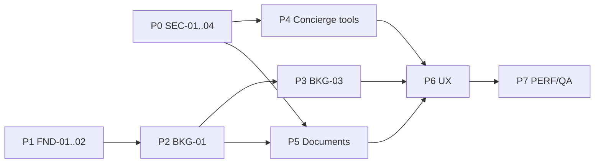

# SiamEZ 2.0 — Refactor Backlog (Orchestrator)

**Status:** Prioritized 2026-08-01 · **Code modified:** None  
Ordered for merge risk and roadmap gates. Aligns with [ROADMAP.md](./ROADMAP.md) phases and [AUDIT.md](./AUDIT.md) debt.

**Priority key:** P0 blocking · P1 foundation · P2 structural · P3 cleanup  
**Effort:** S (&lt;1d) · M (1–3d) · L (1–2w) · XL (&gt;2w)

---

## Top 5 recommendations (start here)

| # | Item | Why | Owner | Phase |
|---|------|-----|-------|-------|
| 1 | **Guard all mutating Server Actions** (`case.ts` fully open; large `admin.ts` middle unguarded; document metadata) | Blocks Concierge tools and any public action abuse | A10 | P0 |
| 2 | **Lock down `POST /api/upload` general path** | Unauthenticated Blob writes | A10 | P0 |
| 3 | **Universal wizard engine + `formConfig`** | ~2.7k LOC duplicated wizards; `documentIds` always undefined | A05→A06 | P2–P3 |
| 4 | **Service catalog single source of truth** | Drift across `services.ts`, `service-catalog.ts`, `service-search.ts`, seed, pages | A01 docs + A06/A11 | P1–P3 |
| 5 | **Split / harden `actions/admin.ts` (~1.5k LOC)** | After auth guards: domain modules + consistent `requireStaff` | A10 then A09 | P0→P6 |

---

## P0 — Security (must before AI mutations)

| ID | Item | Evidence | Effort | Owner | Acceptance |
|----|------|----------|--------|-------|------------|
| SEC-01 | Auth on `actions/case.ts` | `updateCaseStatus`, `assignStaff`, `addCaseNote` have **zero** session checks | S | A10 | `requireStaff` (or equivalent); unauth returns error |
| SEC-02 | `ensureStaffAccess` / `requireStaff` on remaining `admin.ts` exports | Guaranteed only on freelancer/company/ad/payment-settings slices; clients/services/cases/invoices/payments/docs/calendar/staff/service-jobs largely open | M | A10 | Every export calls guard; smoke admin after login |
| SEC-03 | Authenticate `uploadDocumentMetadataAction` | No `requireAuth` today | S | A10 | Owner or staff only |
| SEC-04 | Close or sign general `/api/upload` | Comment admits sales path “no auth” | M | A10 | Auth or purpose-scoped signed upload; chat/tracking remain purpose-gated |
| SEC-05 | QA checklist for P0 | — | S | A12 | Documented smoke: login → book → admin case |

**Orchestrator gate:** Do not merge Concierge **mutating** tools until SEC-01–04 land on `siamez-2.0`.

---

## P1 — Foundation (parallel with design system)

| ID | Item | Evidence | Effort | Owner | Acceptance |
|----|------|----------|--------|-------|------------|
| FND-01 | Expand UI kit (dialog/sheet/form/skeleton/table) | Only 9 primitives | M | A02 | Documented; no route breakage |
| FND-02 | Motion presets (Framer) | None shared today | S | A02 | 2–3 presets for Concierge/wizard |
| FND-03 | Service metadata SSOT plan | Multi-file catalogs | S | A01→A06 | Written plan + owner; optional thin adapter |
| FND-04 | Session callback DB hit review | JWT role refresh | S | A10/A11 | Fewer queries or cached role |
| FND-05 | Retire unused `lib/session.ts` | Dead iron-session | S | A10 | File removed or clearly deprecated |

---

## P2–P3 — Booking architecture

| ID | Item | Evidence | Effort | Owner | Acceptance |
|----|------|----------|--------|-------|------------|
| BKG-01 | JSON wizard engine | 4 near-copy wizards 588–727 LOC | L | A05 | ≥1 generic slug via `formConfig` + `submitBooking` |
| BKG-02 | Wire `documentIds` in booking | All wizards pass `undefined` | M | A05/A07 | Upload attaches real IDs |
| BKG-03 | Migrate 13 services | Specialty + generic | XL | A06 | Parity; specialty deleted or flagged |
| BKG-04 | Autosave / resume | Not present | M | A05 | Guest + logged-in resume |
| BKG-05 | Deprecate `/booking` redirect debt | Legacy redirect exists | S | A06 | Docs + monitoring only |

---

## Cross-cutting duplication

| ID | Item | Evidence | Effort | Owner | Phase |
|----|------|----------|--------|-------|-------|
| DUP-01 | Merge service grids | `ServiceGrid` / `ServicesGrid` / `ServiceDirectoryGrid` | M | A02/A08 | P1–P6 |
| DUP-02 | Unify `payment/` vs `payments/` | Split folders | S | A02/A09 | P1 |
| DUP-03 | Sales vs RE listing modals | ~780–805 LOC parallel | L | A09 | P6 |
| DUP-04 | Dual invoice detail clients | Admin + portal | M | A08/A09 | P6 |
| DUP-05 | Clarify `Job` vs `MarketplaceJob` | Overlapping models | M | A10 docs + careful API | P6 |

---

## Portal & admin UX (P6)

| ID | Item | Effort | Owner | Acceptance |
|----|------|--------|-------|------------|
| UX-01 | Customer timeline + notifications inbox | L | A08 | Prefs → visible inbox |
| UX-02 | Replace `/admin/reports` placeholder | M | A09 | Real analytics from existing data |
| UX-03 | Split colocated admin giants (calendar, listing modals, invoice wizard) | L | A09 | Loadable chunks; same actions |
| UX-04 | Document review queue UX | M | A09 + A07 | Uses existing document DA |

---

## Performance & quality (P7)

| ID | Item | Effort | Owner | Acceptance |
|----|------|--------|-------|------------|
| PERF-01 | `next/dynamic` for wizards + admin giants | M | A11 | Smaller initial bundles |
| PERF-02 | Replace raw `` (chat, ads, QR, attachments) | M | A11 | `next/image` or justified exceptions |
| PERF-03 | Cache tags / reduce `force-dynamic` where safe | M | A11 | Measured TTFB win |
| QA-01 | Smoke test suite (book → case → checkout → portal) | M | A12 | CI runnable |
| QA-02 | Lint gate strategy | S | A12 | Baseline or fix path for ~40 errors |
| DOC-01 | Refresh `docs/ARCHITECTURE.md` (still MySQL-era) | S | A01 | Points to Postgres + this pack |

---

## Explicit non-goals (do not refactor yet)

- Rewriting Auth.js or Prisma schema for AI
- New payment providers
- Replacing next-intl
- Big-bang deletion of specialty wizards before P3 parity
- Migrating away from Case-centric domain

---

## Suggested Orchestrator sequencing

**Wave guidance:**

1. **Now:** SEC-* + A01 docs (this pack) + A02 primitives  
2. **Next:** BKG-01 engine behind feature flag; Concierge UI without mutations  
3. **Then:** BKG-03 migration + document IDs + Concierge tools  
4. **Later:** Dashboard polish, DUP-*, PERF-*

---

## Tracking

Update status when items merge to `siamez-2.0`:

| ID | Status |
|----|--------|
| SEC-01…05 | In flight (A10/A12) |
| FND-01…02 | In flight (A02) |
| This backlog | Published (A01) |
| BKG-* / UX-* / PERF-* | Queued |

Owners must not expand scope outside [AGENTS.md](./AGENTS.md) ownership without Orchestrator approval.
