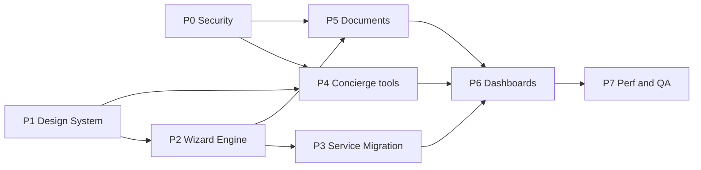

# SiamEZ 2.0 — Master Roadmap

**Status:** Approved 2026-08-01 · **Implementation:** Wave 1+2 in flight  
**Integration branch:** `siamez-2.0`

All phases preserve existing business functionality. Prefer reuse over rewrite.

---

## Phase P0 — Security Hardening

| Field | Detail |
|-------|--------|
| **Objective** | Close auth gaps before AI tools can mutate cases/documents |
| **Agents** | A10 (Backend), A12 (QA) |
| **Files affected** | `src/actions/**`, `src/app/api/upload/**`, `src/middleware.ts`, auth helpers |
| **Dependencies** | None |
| **Effort** | 1–2 days |
| **Risk** | Critical (if skipped before Concierge) |
| **Deliverables** | Auth on all mutating Server Actions; authenticated upload paths; QA checklist |
| **Acceptance** | No unauthenticated mutation of cases/docs/invoices; `/api/upload` requires auth or purpose-scoped signed upload; smoke: login → book → admin case view |

---

## Phase P1 — Foundation & Design System

| Field | Detail |
|-------|--------|
| **Objective** | Shared visual language and analyst baseline for all later UI |
| **Agents** | A01 (Analyst), A02 (Design System) |
| **Files affected** | `src/components/ui/**`, `src/app/globals.css`, `src/lib/theme.ts`, `src/components/theme/**`, `docs/siamez-2.0/**` |
| **Dependencies** | P0 recommended in parallel |
| **Effort** | 1–2 weeks |
| **Risk** | Medium |
| **Deliverables** | Design tokens; expanded primitives (dialog, sheet, form, skeleton, table); Framer Motion guidelines; dependency graph docs |
| **Acceptance** | Existing pages render unchanged or improved; new primitives documented; no route breakage; brand (`siam.blue` / `siam.yellow`) preserved |

---

## Phase P2 — Universal Wizard Engine

| Field | Detail |
|-------|--------|
| **Objective** | One JSON-driven booking engine replacing duplicated wizard logic |
| **Agents** | A05 |
| **Files affected** | `src/components/wizard/**` (new), wizard config types, `src/app/[locale]/book/[service-slug]/page.tsx` (thin wiring only) |
| **Dependencies** | P1 (UI primitives); must call existing `submitBooking` |
| **Effort** | 2–3 weeks |
| **Risk** | High |
| **Deliverables** | Engine: steps, conditionals, progress, Zod validation, autosave, resume, animations; wire ≥1 generic service via `formConfig` |
| **Acceptance** | Generic slug books end-to-end via engine; guest + logged-in paths; autosave/resume works; specialty wizards still available until P3 |

---

## Phase P3 — Service Migration

| Field | Detail |
|-------|--------|
| **Objective** | Convert all 13 services onto the wizard engine |
| **Agents** | A06 |
| **Status** | In progress on `agent/06-service-migration` — see `docs/siamez-2.0/A06-SERVICE-MIGRATION.md` |
| **Files affected** | Wizard JSON configs, seed/`formConfig`, book page switch, retire `src/components/booking/*Wizard.tsx` after parity |
| **Dependencies** | P2 complete |
| **Effort** | 2–3 weeks |
| **Risk** | High (field parity) |
| **Deliverables** | Configs for all slugs including driver-license, vehicle finder, real estate, marriage, translation, insurance-adjacent, police clearance, vehicle buy/sell |
| **Acceptance** | Each service produces equivalent `formData` shape; checkout/quote paths unchanged; specialty wizards deleted or deprecated behind flag |

---

## Phase P4 — AI Concierge & Interactive Signup

| Field | Detail |
|-------|--------|
| **Objective** | Persistent multilingual assistant + conversational onboarding |
| **Agents** | A03, A04 (parallel after P1; mutating tools after P0) |
| **Files affected** | `src/components/ai/**`, `src/lib/ai/**`, `src/hooks/ai/**`, auth register/login UI, profile onboarding |
| **Dependencies** | P0 for tools; P1 for shell; P2 optional for “start booking” deep-link |
| **Effort** | 3–4 weeks |
| **Risk** | High |
| **Deliverables** | Streaming concierge, history, quick actions, voice-ready architecture, service recommendations, booking handoff; conversational signup + social login polish + progressive profile |
| **Acceptance** | Guest can discover service via chat and land in wizard; signup completes via existing register/OAuth; en/th; no new payment providers |

---

## Phase P5 — AI Document Assistant

| Field | Detail |
|-------|--------|
| **Objective** | OCR-ready upload → extract → missing-doc detection → wizard prefill |
| **Agents** | A07 |
| **Files affected** | Document domain, upload UI, extract stubs, wizard prefill API |
| **Dependencies** | P2 (prefill contract); Blob helpers |
| **Effort** | 2–3 weeks |
| **Risk** | Medium |
| **Deliverables** | Unified upload UX; quality validation; extraction interface (provider-pluggable); missing document checklist; autosave into case/wizard |
| **Acceptance** | Upload attaches real `documentIds` to booking; extract stub returns structured fields; wizard can prefill; works without OCR provider (graceful degrade) |

---

## Phase P6 — Customer & Staff Dashboards

| Field | Detail |
|-------|--------|
| **Objective** | Premium operational UX without changing data contracts |
| **Agents** | A08 (portal), A09 (admin) |
| **Files affected** | Portal customer routes/components; admin dashboard/cases/docs/reports UX |
| **Dependencies** | P4 helpful for AI summaries; P5 for doc review |
| **Effort** | 2–3 weeks |
| **Risk** | Medium |
| **Deliverables** | Customer: timeline, bookings, appointments, docs, notifications inbox, invoices, AI tips, chat history, profile. Staff: customer timeline, doc review, tasks, scheduling, AI summaries, analytics (replace reports placeholder), notes, quote/invoice aids |
| **Acceptance** | Role dashboards load with existing data; no ops regression; reports page no longer placeholder |

---

## Phase P7 — Performance & Release QA

| Field | Detail |
|-------|--------|
| **Objective** | Ship-ready quality bar |
| **Agents** | A11, A12 |
| **Files affected** | Dynamic imports, images, SEO (sitemap/robots), tests, CI |
| **Dependencies** | Feature freeze candidate after P6 |
| **Effort** | 1–2 weeks |
| **Risk** | Medium |
| **Deliverables** | Bundle splits for wizards/admin giants; image hygiene; a11y pass; Lighthouse targets; test smoke suite; release report |
| **Acceptance** | Lint/type gates defined; booking + portal + admin smoke green; no critical a11y/security findings |

---

## Sequencing diagram

---

## Merge workflow

1. Agent opens PR from `agent/<id>-<slug>` → `siamez-2.0`  
2. Orchestrator reviews ownership boundaries + conflict matrix  
3. Validate standards (TS, Tailwind, reuse, Zod/RHF where forms grow)  
4. Smoke: book → case → checkout/portal (and admin if touched)  
5. Merge; update progress in this folder + orchestrator canvas  
6. Never expand scope outside ownership without Orchestrator approval  

---

## Progress tracking

| Phase | Status |
|-------|--------|
| Audit | Done |
| Roadmap approval | **Approved** |
| P0 Security (A10) | **Merged** (`09b6370` → `9905fae`) |
| P0 QA gates (A12) | **Merged** (`2e785b8`; 32 tests green) |
| P1 Analyst docs (A01) | **Merged** (`a06b468`) |
| P1 Design system (A02) | **Merged** (`14b8a92`) |
| P2 Wizard engine (A05) | **Merged** (`42f2453`; slug `marriage-registration`) |
| P3 Service migration (A06) | **Merged** (`b27f566`; 13/13 slugs) |
| P4 Signup (A04) | **Merged** (`6e761fc`) |
| P4 Concierge (A03) | **Merged** (`5dd29c2`) |
| P5 Documents (A07) | **Merged** (`1034d8d`) |
| P6 Customer dashboard (A08) | **Merged** (`92737cc`) |
| P6 Staff dashboard (A09) | In flight |
| P7 Perf & QA | Queued |

Blockers, risks, and agent status live on the Orchestrator canvas.
