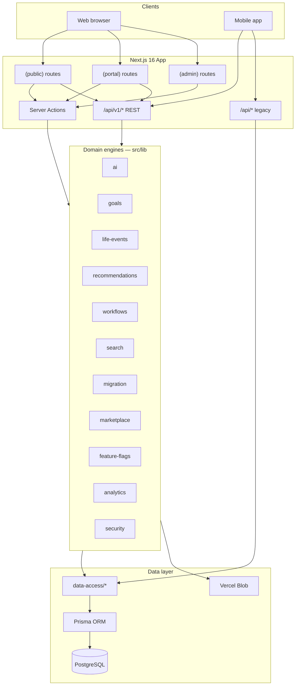

# SiamEZ Platform 2.0 / 2.1 — Architecture

**Stack:** Next.js 16 (App Router) · TypeScript · Tailwind · Prisma · PostgreSQL (Neon)  
**Pattern:** Hybrid Server Actions (web) + REST `/api/v1/*` (mobile bridge)

---

## High-level diagram

---

## Route shells

| Shell | Path prefix | Auth |
|-------|-------------|------|
| Public | `/[locale]/` — services, sales, real-estate, book, concierge | Optional |
| Portal | `/[locale]/portal/` | Session required (middleware) |
| Admin | `/[locale]/admin/` | Session + staff role (layout) |
| Auth | `/[locale]/login`, `/register` | Guest |

Locale routing via `next-intl` (`en`, `th`).

---

## Engine modules

Additive engines live under `src/lib/`. Do not fork business logic into routes — call engines from Server Actions, `/api/v1`, or Concierge tools.

| Engine | Path | Responsibility |
|--------|------|----------------|
| AI / Concierge | `src/lib/ai/**` | Rule + optional LLM replies, tools, journey context, orchestration |
| Goals | `src/lib/goals/**` | Customer goal CRUD, progress helpers |
| Life events | `src/lib/life-events/**` | Configurable journeys, step progress |
| Recommendations | `src/lib/recommendations/**` | Graph-driven suggestions, admin edges |
| Workflows | `src/lib/workflows/**` | Template runs, transitions, next-steps |
| Search | `src/lib/search/**` | Fuse.js unified corpus, deep links |
| Migration | `src/lib/migration/**` | Listing URL contracts, SEO enhancement, inventory |
| Marketplace | `src/lib/marketplace/**` | Badges, related listings, people-also-viewed |
| Marketplace engagement | `src/lib/marketplace-engagement/**` | Save/compare/view cookie + user merge |
| Feature flags | `src/lib/feature-flags.ts` | DB-backed toggles with 30s cache |
| Analytics | `src/lib/analytics/**` | Platform metrics, event tracking |
| Security | `src/lib/security/**` | Rate limit, magic-byte sniff |
| Admin ops | `src/lib/admin/**` | Work queue, bottlenecks, case summaries |

**WizardEngine** (`src/components/wizard/`) is a **UI engine** for service booking — not the Universal Workflow Engine. See [WORKFLOWS.md](./WORKFLOWS.md).

---

## Data access

- `src/data-access/*` — Prisma queries shared by web and API
- `src/actions/*` — Server Actions (auth-gated mutations)
- `src/lib/domain/*` — Case, document, payment domain helpers

---

## URL contracts (preserve)

Listing public URLs use **cuid `id`**, never slug:

- Vehicles: `/sales/[id]`
- Properties: `/real-estate/[id]`

Helpers: `src/lib/migration/urls.ts` — `buildSalesListingPath`, `buildRealEstateListingPath`.

Do not remove existing listings or change URL shape.

---

## Auth model

| Channel | Mechanism |
|---------|-----------|
| Web | Auth.js v5 JWT session cookie |
| Mobile / API | `Authorization: Bearer <API_JWT>` via `POST /api/auth/login` |
| Middleware | JWT verify on `/api/cases`, `/api/documents`, `/api/invoices`, `/api/payments`; sets `x-api-user-id` |

Server-side guards: `requireAuth`, `requireStaff`, `requireFreelancer`, `requireCompany`.

---

## Concierge integration

Mounted on public + portal layouts (`AiConciergeShell`, lazy `ssr: false`).

Flow: client message → `requestConciergeReply` → rule/LLM → tools (search, recommend, escalate, orchestrate LE/workflow) → reply with chips/deep links.

Journey memory: client `localStorage` + server merge via `src/lib/ai/journey-context.ts`.

---

## Feature flags (2.1)

DB model `FeatureFlag`; defaults in `DEFAULT_FLAGS`. Admin toggle at `/admin/feature-flags`. Read via `isFeatureEnabled(key)`.

---

## Related docs

- [API.md](./API.md) — route map
- [WORKFLOWS.md](./WORKFLOWS.md) — workflow vs wizard
- [MARKETPLACE.md](./MARKETPLACE.md) — listing engagement
- [ADMIN.md](./ADMIN.md) — staff surfaces
- [DEVELOPER.md](./DEVELOPER.md) — local setup
- [../PLATFORM-2.1-SECURITY.md](../PLATFORM-2.1-SECURITY.md) — security review
